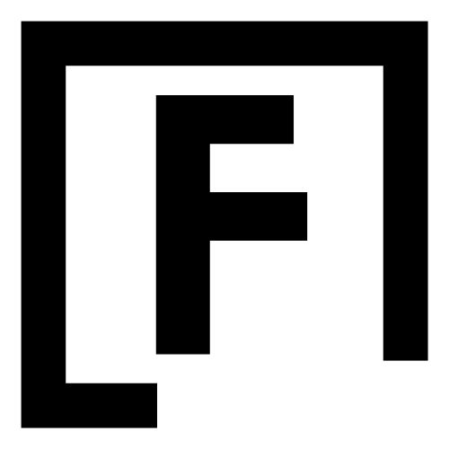
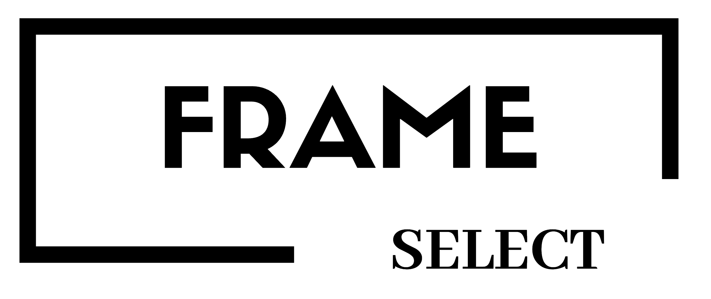

#  Frame Select

## ■サービス概要 
部屋に合うポスターや絵画を提案してくれるサービスです  
ポスターや絵画を飾りたいと考えている壁を撮影して、デザインの好みの質問に答えるorレコメンドしてもらうことで、インテリアの雰囲気にあった絵を提案、実際に飾った場合どのような見た目になるのかを見ることが出来ます  
ポスターが気に入ればそのまま購入できるような導線も用意しています

### ■ このサービスへの思い・作りたい理由 
1人暮らしを始めたとき、コンクリート打ちっぱなしの部屋でなにか絵やポスターを飾りたいと思ったが、 実際にどんなポスターが今のインテリアに合うのか、実際に飾ったら部屋のイメージがどのようになるのかが分からなかったため買うことが無かった。  
しかし、最近きっかけがあって飾るようになったところ部屋のインテリアに統一感が出たことから、飾るハードルを少しでも下げるきっかけになるサービスを提供したいと思いました。

### ■ ユーザー層について
ひとり暮らしを初めて、部屋のインテリアを充実させたいと思っている男女20代  
インテリアを自分で考えるようになる最初のタイミングであるひとり暮らし初めであること、どんなものにしようか迷う層がターゲットです  

### ■サービスの利用イメージ
飾る絵やポスターのイメージに迷った際に、アプリを利用することで部屋のインテリアに合ったポスターや絵を知ることができる。
実際に飾るイメージを知れることで購入のハードルが下がり、実際に飾って理想のインテリアに近づけることが出来る。

### 色彩マッチング機能
<video src="https://github.com/harumasa-iino/portfolio/assets/139933050/a449a951-0e98-4e79-adf8-4866c5a8f530
" controls="true" width="600" ></video>

### AI画像マッチング機能
<video src="https://github.com/harumasa-iino/portfolio/assets/139933050/38eeb7cd-f450-4884-87e8-45c48be0ac1e
" controls="true" width="600" ></video>

## ■ 使用技術一覧

## ■ 使用技術詳細
- Ruby 3.1.4
- Ruby on Rails 7.0.8
- MySQL 8.3.0
- Nginx
- Bootstrap
- Puma
- AWS
    - VPC
    - EC2
    - RDS
    - Route53
- Docker/Docker-compose
- GitHub Actions
- RSpec
- Google Vision API
- OpenAI API DALL·E 3

## AWS構成図

### CI/CD
- Git hubでmasterへマージした際にGit hub ActionsによってEC2へ自動デプロイが実行されます

## ■ 機能一覧
- 認証機能(device)
    - ユーザー登録
    - ログイン
    - ログアウト
    - Googleアカウントでのログイン・登録(Google Oauth)
    - パスワードの再設定
- 画像アップロード(CarrierWave)
- ポスターとのマッチング機能
    - デザインタイプの質問/回答
    - 画像解析(Google Vision API)によるレコメンド機能
- 画像合成機能(MiniMagic)
- AI画像生成機能(OpenAI API DALL·E 3)
- マイページへの画像保存
- ポスター/絵画データベース
- ポスターの購入導線

### テスト
- RSpec

## ER図

