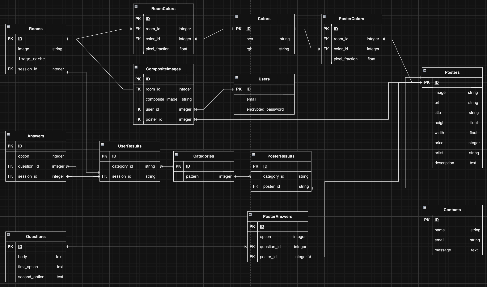

# portfolio
## ■サービス概要 

部屋に合うポスターや絵画を提案してくれるアプリ ポスターや絵画を飾りたいと考えている壁を部屋のインテリアと一緒に撮影するだけで、インテリアの雰囲気にあった絵を提案して実際に飾った場合どのような見た目になるのかを見ることが出来るアプリ。購入リンクをつけてそのまま購入の検討まで可能

## ■ このサービスへの思い・作りたい理由 

1人暮らしを始めたとき、コンクリート打ちっぱなしの部屋でなにか絵やポスターを飾りたいと思ったが、 実際にどんなポスターが今のインテリアに合うのか、実際に飾ったら部屋のイメージがどのようになるのかが分からなかったため買うことが無かった。

最近きっかけがあって飾るようになったところ部屋のインテリアに統一感が出て充実した気分になったので、飾るハードルを少しでも下げるきっかけになるサービスを提供したいと思ったため。

## ■ ユーザー層について

ひとり暮らしを初めて、部屋のインテリアを充実させたいと思っている男女20代

インテリアを自分で考えるようになる最初のタイミングであるひとり暮らし初めであること、どんなものにしようか迷う層であるため

## ■サービスの利用イメージ

飾る絵やポスターのイメージに迷った際に、アプリを利用することで部屋のインテリアに合ったポスターや絵を知ることができる。

実際に飾るイメージを知れることで購入のハードルが下がり、実際に飾って理想のインテリアに近づけることが出来る。

## ■ ユーザーの獲得について 
SEO対策を行い「ポスター 部屋 おしゃれ」などで検索したユーザーに対してサービスを届ける

## ■ サービスの差別化ポイント・推しポイント 

家具の配置アプリはあるが、絵画やポスターに特化したアプリはまだないため。

## ■ 主な機能
未チェック箇所は本リリース（04/20）までに実装予定
- [x] 部屋の写真アップロード機能
- [x] ポスター/絵画データベース
- [x] ポスターフィルター機能
- [x] 部屋の写真とポスターの合成画像表示
- [x] 会員登録
- [x] 好みの合成画像を保存
- [x] ポスターの購入導線
- [ ] 部屋の色彩認識
- [ ] ポスターの色彩認識
- [ ] 色合いでのマッチング機能
- [ ] 好みのポスターをARで確認

## ■ 使用技術
- Rubyバージョン: 3.1.4
- Railsバージョン: 7.0.8
- フレームワーク: Ruby on Rails
- コンテナ化: Docker、Docker Compose
- データベース: MySQL（開発環境）、Amazon RDS for MySQL（本番環境）
- テストフレームワーク：RSpec
- 画像処理: MiniMagick（画像合成や加工）
- 画像解析: Google Vision API
- ファイルアップロード: CarrierWave
- 認証: Google APIを利用したOAuth認証
- 認証：Devise
- デプロイメント:AWS
- CI/CD：GitHub Actions

## 画面遷移図
https://www.figma.com/file/yIQoFFfZWzQS7DEjzxoHnt/%E7%94%BB%E9%9D%A2%E9%81%B7%E7%A7%BB%E5%9B%B3?type=whiteboard&node-id=0%3A1&t=57l0QB5S0kEpsJDx-1

ユーザビリティ確認のためにそれぞれの画面詳細も追加

## ER図
https://app.diagrams.net/#G1CY3KqoKHvMPbawyjoVnzfd7X0p63g0h_

